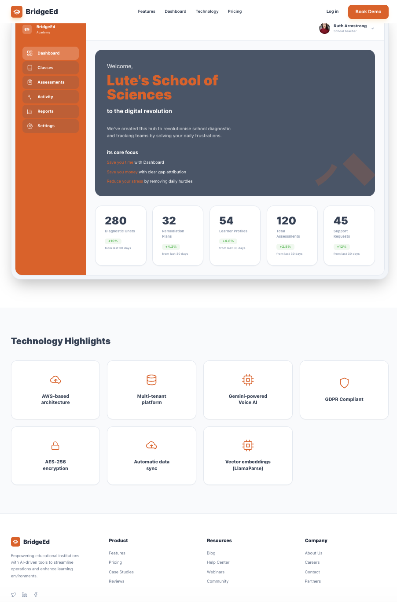
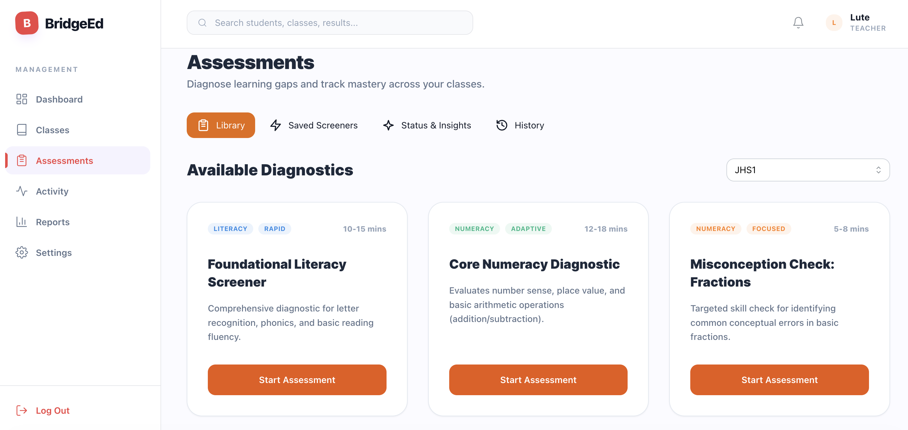

# BridgeEd Monorepo Scaffold

## Implemented User Story Scope
- Foundational scaffolding for all epics.
- Specifically enables future work for `US-1.3` (RBAC foundation), `US-4.3` (offline-ready client architecture), and `US-5.2` (server-only AI scoring path).

## Visual Inspirations

##

##


##

##


## Stack
- Monorepo: `pnpm` + `Turborepo`
- Web: React + TypeScript + Vite + Mantine + Tailwind + TanStack React Query
- API: Node.js + TypeScript + Express + Mongoose + Zod
- Shared: `@bridgeed/shared` (types, constants, schemas)

## Structure
- `apps/web` - Vite React client
- `apps/api` - Express REST API (`/api/v1`)
- `packages/shared` - shared types + zod schemas

## API Endpoints
- `GET /api/v1/health` -> `{ data: { status: "ok", name: "BridgeEd API" } }`
- `GET /api/v1/version` -> `{ data: { version: "0.1.0", env: "development" } }`

## Setup
1. Install dependencies:
   ```bash
   pnpm install
   ```
2. Optionally copy env templates (the API also loads `.env.example` if `.env` is absent):
   ```bash
   cp apps/api/.env.example apps/api/.env
   cp apps/web/.env.example apps/web/.env
   ```
3. Start web + api:
   ```bash
   pnpm dev
   ```
4. Open the web app:
   - `http://localhost:5173`

## Monorepo Scripts
- `pnpm dev` - runs shared build + web/api dev servers
- `pnpm build` - turbo build
- `pnpm lint` - turbo lint
- `pnpm typecheck` - turbo typecheck
- `pnpm test` - placeholder test script

## Assumptions
- Local MongoDB is available at `mongodb://127.0.0.1:27017/bridgeed`.
- `GEMINI_API_KEY` is required by env validation even though Gemini calls are not implemented yet.
- API responses are standardized in `{ data }` / `{ error }` envelope across endpoints.

## TODO (Intentional)
- Implement auth, RBAC middleware, and audit logging entity writes.
- Implement offline persistence/sync queue in the client feature slices.
- Implement Gemini orchestration in `apps/api/src/services/gemini/gemini.service.ts` with schema-validated outputs.
